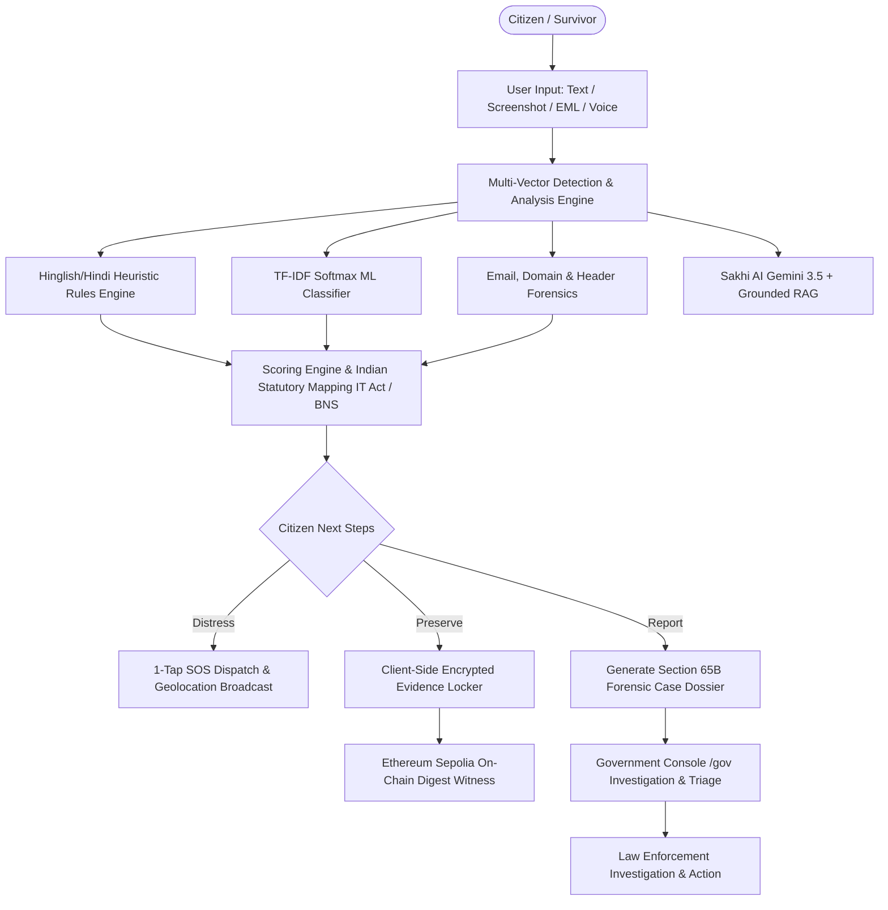
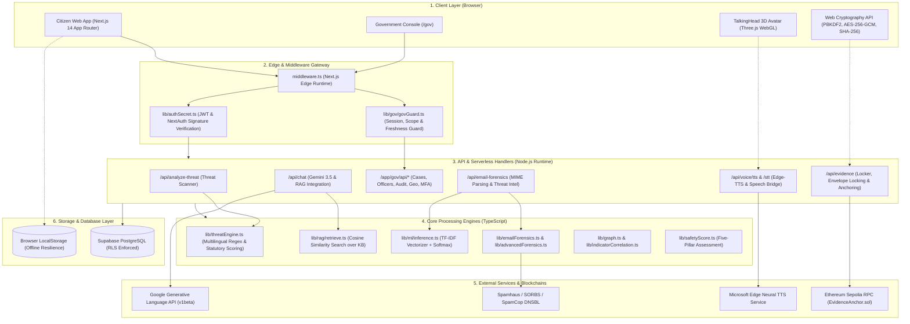
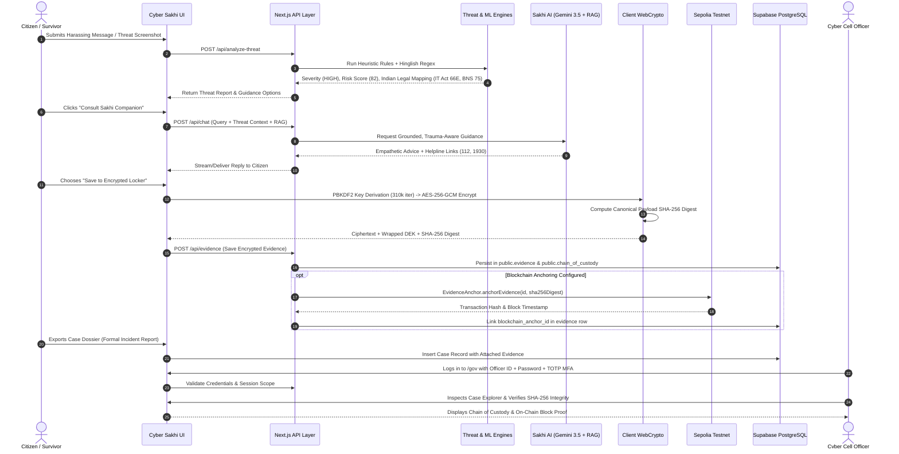
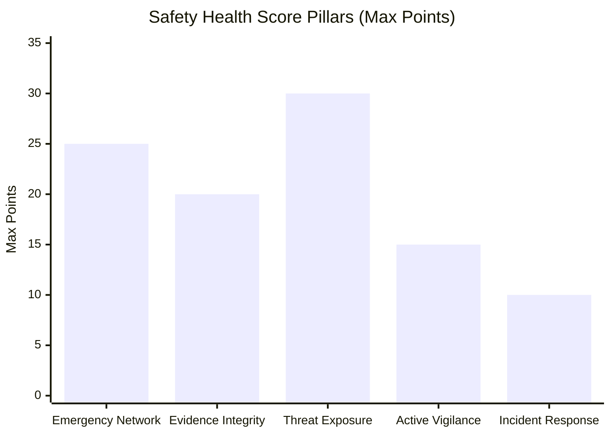
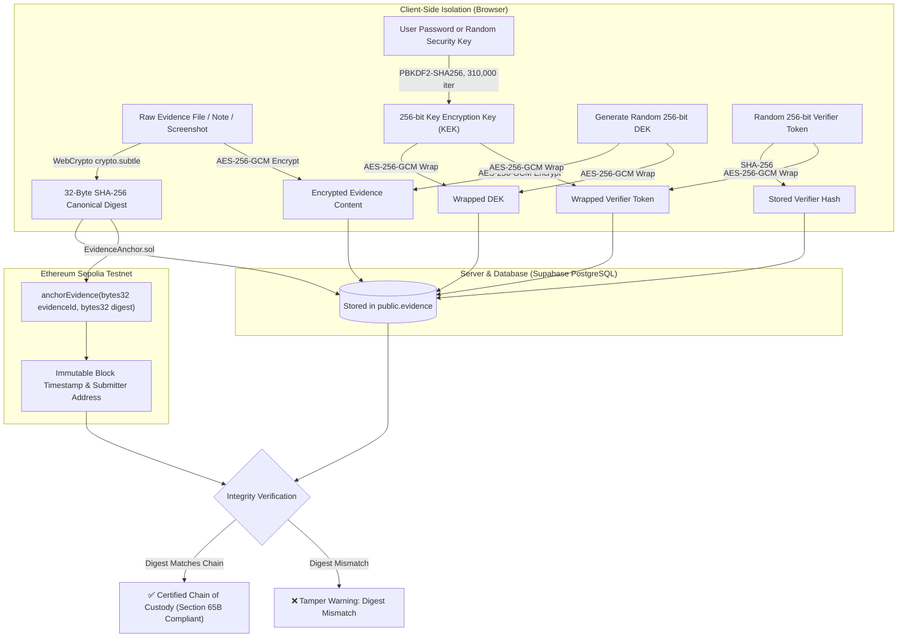
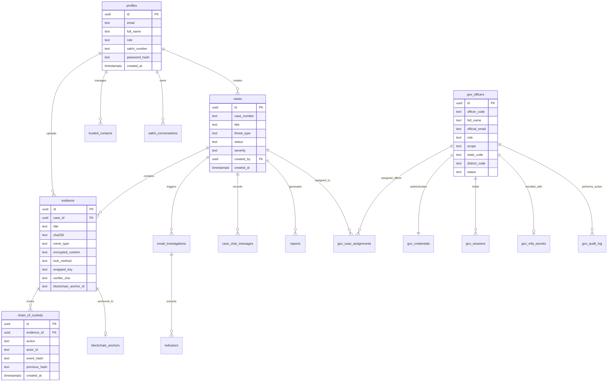

# 🛡️ Cyber Sakhi

> **Unified AI Platform for Multimodal Digital Threat Detection, Trauma-Informed Survivor Assistance, Cryptographic Evidence Custody, and Law Enforcement Intelligence.**

[](https://nextjs.org/)
[](https://www.typescriptlang.org/)
[](https://tailwindcss.com/)
[](https://supabase.com/)
[](https://sepolia.etherscan.io/)
[](https://vitest.dev/)
[](https://threejs.org/)

---

## 📌 Table of Contents

- [🚨 Problem Statement](#-problem-statement)
- [💡 Solution](#-solution)
- [✨ Key Features](#-key-features)
- [🏗️ System Architecture](#️-system-architecture)
- [🔄 End-to-End Application Workflow](#-end-to-end-application-workflow)
- [🔍 Threat Detection & Analysis Pipeline](#-threat-detection--analysis-pipeline)
- [📊 Risk & Threat Scoring Models](#-risk--threat-scoring-models)
- [🔐 Evidence Locker & Cryptographic Security](#-evidence-locker--cryptographic-security)
- [🤖 Sakhi AI & Multimodal Companion](#-sakhi-ai--multimodal-companion)
- [🏛️ Government & Law Enforcement Console](#️-government--law-enforcement-console)
- [🧩 Technology Stack](#-technology-stack)
- [📁 Project Structure](#-project-structure)
- [🔌 API & Route Reference](#-api--route-reference)
- [🗄️ Database & Schema Design](#️-database--schema-design)
- [⚙️ Installation & Setup](#️-installation--setup)
- [🚀 Deployment](#-deployment)
- [🧪 Testing](#-testing)
- [🛡️ Security Considerations](#️-security-considerations)
- [🗺️ Roadmap](#️-roadmap)
- [🤝 Contributing](#-contributing)
- [📜 License](#-license)
- [👥 Team](#-team)
- [📸 Screenshots & Visual Assets](#-screenshots--visual-assets)

---

## 🚨 Problem Statement

Online harassment, non-consensual image distribution, sextortion, impersonation, phishing, and cyberstalking in India have grown exponentially. Despite this, victims face severe barriers when seeking help:

1. **Trauma and Intimidation**: Survivors often hesitate to report incidents to authorities due to stigma, fear of retaliation, or embarrassment, especially when messages are written in colloquial code (Hinglish/Hindi).
2. **Fragile Digital Evidence**: Digital proof (WhatsApp chats, Instagram DMs, spoofed emails) is routinely deleted, tampered with, or rejected by legal courts due to broken chains of custody and non-compliance with statutory standards (**Section 65B of the Indian Evidence Act / Section 63 Bharatiya Sakshya Adhiniyam**).
3. **Investigation Bottlenecks**: Law enforcement officers and cyber cells are inundated with unformatted, unstructured victim complaints without technical indicators (SMTP hops, SPF/DKIM verification, domain age, malware indicators).
4. **Jurisdictional Fragmentation**: Triage between national, state, and district police jurisdictions often delays urgent intervention during ongoing physical or digital distress.

---

## 💡 Solution

**Cyber Sakhi** bridges the gap between distressed citizens and law enforcement with a secure, bilingual, end-to-end pipeline:

1. **Multilingual Heuristic & ML Threat Detection**: Immediate detection of extortion, physical threats, sexual harassment, and financial scams across English, Romanised Hindi (Hinglish), and Devanagari script, coupled with a pure-TypeScript multinomial ML classifier trained on 60,000 TF-IDF features.
2. **Trauma-Informed Multimodal AI Companion**: Powered by Google Gemini (`gemini-3.5-flash`) with sublinear TF-IDF cosine-similarity Retrieval-Augmented Generation (RAG) over verified public safety knowledge bases, paired with an interactive 3D WebGL avatar (`sakhi.glb` + Three.js) and neural Hindi/English text-to-speech.
3. **Cryptographically Sealed Evidence Locker**: Client-side envelope encryption (**PBKDF2-SHA256** with 310,000 iterations + **AES-256-GCM**) ensuring zero plaintext exposure, combined with canonical SHA-256 hashing and optional immutable **Ethereum Sepolia blockchain anchoring** via the `EvidenceAnchor.sol` smart contract.
4. **Authoritative Government Console (`/gov`)**: Built for cyber crime investigators, district officers, and forensic analysts with Google Authenticator **TOTP MFA**, bcrypt credential protection, territorial jurisdiction access control (**RBAC + ABAC**), interactive **3D India WebGL geospatial threat visualization**, and automated court-compliant dossier generation.



---

## ✨ Key Features

| Feature | Description | Primary Route / Code Reference |
|---|---|---|
| **Harassment & Threat Scanner** | Instant scanning of text messages, chat excerpts, and threats with severity tiers (`SAFE`, `LOW`, `MEDIUM`, `HIGH`, `CRITICAL`) and statutory legal mapping under the IT Act 2000 and Bharatiya Nyaya Sanhita (BNS). | [`/detector`](file:///c:/Users/Dhair/OneDrive/Desktop/cyber-sakhi-main/app/detector/page.tsx) <br> [`lib/threatEngine.ts`](file:///c:/Users/Dhair/OneDrive/Desktop/cyber-sakhi-main/lib/threatEngine.ts) |
| **Email Forensics Studio** | Deep forensic RFC-822 / MIME parser, full SMTP hop traversal, originating IP extraction, SPF/DKIM/DMARC/ARC validation, RDAP domain age profiling, DNSBL threat intel, and BEC detection. | [`/email-forensics`](file:///c:/Users/Dhair/OneDrive/Desktop/cyber-sakhi-main/app/email-forensics/page.tsx) <br> [`lib/emailForensics.ts`](file:///c:/Users/Dhair/OneDrive/Desktop/cyber-sakhi-main/lib/emailForensics.ts) |
| **Gmail Security Scanner** | OAuth 2.0 integration allowing users to connect Gmail, inspect recent mail threads, and analyze suspect emails with zero server-side storage of inbox contents. | [`/email-forensics/gmail`](file:///c:/Users/Dhair/OneDrive/Desktop/cyber-sakhi-main/app/email-forensics/gmail/page.tsx) <br> [`lib/gmailApi.ts`](file:///c:/Users/Dhair/OneDrive/Desktop/cyber-sakhi-main/lib/gmailApi.ts) |
| **Sakhi AI Companion** | Trauma-aware bilingual AI companion utilizing Gemini 3.5 Flash, structured JSON responses, image screenshot inspection, and strict system-prompt boundary isolation. | [`/companion`](file:///c:/Users/Dhair/OneDrive/Desktop/cyber-sakhi-main/app/companion/page.tsx) <br> [`lib/ai/gemini.ts`](file:///c:/Users/Dhair/OneDrive/Desktop/cyber-sakhi-main/lib/ai/gemini.ts) |
| **3D Voice Avatar Mode** | Interactive 3D avatar with ARKit/Oculus viseme lip-sync powered by Three.js and TalkingHead runtime, backed by neural Indian English and Hindi Edge-TTS synthesis (`en-IN-NeerjaNeural`, `hi-IN-SwaraNeural`). | [`/companion/voice`](file:///c:/Users/Dhair/OneDrive/Desktop/cyber-sakhi-main/app/companion/voice/page.tsx) <br> [`lib/voice/edgeTts.ts`](file:///c:/Users/Dhair/OneDrive/Desktop/cyber-sakhi-main/lib/voice/edgeTts.ts) |
| **Encrypted Evidence Locker** | Client-side envelope encryption (**AES-256-GCM** with **PBKDF2-SHA256** key derivation), canonical JSON SHA-256 digest creation, and cryptographic chain-of-custody verification. | [`/locker`](file:///c:/Users/Dhair/OneDrive/Desktop/cyber-sakhi-main/app/locker/page.tsx) <br> [`lib/lockCrypto.ts`](file:///c:/Users/Dhair/OneDrive/Desktop/cyber-sakhi-main/lib/lockCrypto.ts) |
| **Blockchain Evidence Anchoring** | Tamper-evident anchoring of SHA-256 evidence digests onto the **Ethereum Sepolia testnet** using the `EvidenceAnchor` smart contract or data-carrier calldata transactions. | [`blockchain/contracts/EvidenceAnchor.sol`](file:///c:/Users/Dhair/OneDrive/Desktop/cyber-sakhi-main/blockchain/contracts/EvidenceAnchor.sol) <br> [`lib/blockchain/provider.ts`](file:///c:/Users/Dhair/OneDrive/Desktop/cyber-sakhi-main/lib/blockchain/provider.ts) |
| **Emergency SOS & Trusted Network** | 1-tap SOS trigger with countdown safeguard, automatic browser geolocation capture, and multi-channel dispatch simulation (SMS & WhatsApp payloads) to verified contacts. | [`/sos`](file:///c:/Users/Dhair/OneDrive/Desktop/cyber-sakhi-main/app/sos/page.tsx) <br> [`app/contacts/page.tsx`](file:///c:/Users/Dhair/OneDrive/Desktop/cyber-sakhi-main/app/contacts/page.tsx) |
| **Five-Pillar Safety Score** | Mathematical 100-point security health posture score evaluating Emergency Network (25), Evidence Integrity (20), Threat Exposure (30), Active Vigilance (15), and Incident Response (10). | [`/dashboard`](file:///c:/Users/Dhair/OneDrive/Desktop/cyber-sakhi-main/app/dashboard/page.tsx) <br> [`lib/safetyScore.ts`](file:///c:/Users/Dhair/OneDrive/Desktop/cyber-sakhi-main/lib/safetyScore.ts) |
| **Authoritative Government Console** | Dedicated operational portal for law enforcement with TOTP MFA, territory-scoped case management, evidence custody audits, and 3D geospatial crime visualization. | [`/gov`](file:///c:/Users/Dhair/OneDrive/Desktop/cyber-sakhi-main/app/gov/page.tsx) <br> [`components/gov/GovDashboardShell.tsx`](file:///c:/Users/Dhair/OneDrive/Desktop/cyber-sakhi-main/components/gov/GovDashboardShell.tsx) |
| **3D Geospatial Crime Scene** | Three.js WebGL extrusion of GeoJSON Indian state polygons with interactive orbit controls, camera flights, and jurisdiction case density heat scales. | [`components/gov/India3DScene.tsx`](file:///c:/Users/Dhair/OneDrive/Desktop/cyber-sakhi-main/components/gov/India3DScene.tsx) <br> [`lib/gov/govGeo3D.ts`](file:///c:/Users/Dhair/OneDrive/Desktop/cyber-sakhi-main/lib/gov/govGeo3D.ts) |
| **Offender Network Correlation** | Graph-based threat intelligence connecting malicious phone numbers, UPI IDs, cryptocurrency wallets, email addresses, and bank accounts across disparate cases. | [`components/OffenderNetworkPanel.tsx`](file:///c:/Users/Dhair/OneDrive/Desktop/cyber-sakhi-main/components/OffenderNetworkPanel.tsx) <br> [`lib/graph.ts`](file:///c:/Users/Dhair/OneDrive/Desktop/cyber-sakhi-main/lib/graph.ts) |

---

## 🏗️ System Architecture



---

## 🔄 End-to-End Application Workflow



---

## 🔍 Threat Detection & Analysis Pipeline

The Cyber Sakhi detection pipeline operates without opaque third-party black boxes:

```mermaid
flowchart LR
    A[Raw Input Text/Email] --> B[Script & Language Detection]
    B --> C{Pipeline Dispatch}
    
    C -->|Chat/SMS/Direct Threat| D[Heuristic Threat Engine]
    C -->|Raw EML / MIME Message| E[Email Forensic Pipeline]
    
    subgraph HeuristicPipeline["Hinglish & Indic Threat Engine"]
        D --> D1[Tokenize & Match Regex Patterns]
        D1 --> D2[Category Accumulation: Extortion, Stalking, Violence, Sex, Scam, Hate]
        D2 --> D3[Calculate Severity & Score 0-100]
        D3 --> D4[Map Statutory Sections: IT Act, BNS, IPC]
    end

    subgraph EmailPipeline["Forensic & ML Pipeline"]
        E --> E1[Extract MIME Headers & Trace SMTP Hops]
        E1 --> E2[Verify SPF, DKIM, DMARC & ARC Alignment]
        E2 --> E3[Extract Public Originating IP & Query DNSBL]
        E3 --> E4[RDAP Domain Age & Punycode Homoglyph Analysis]
        E4 --> E5[ML Classifier: TF-IDF 60k Features + Logistic Regression]
        E5 --> E6[BEC & High-Risk Wire Transfer Urgency Signals]
        E6 --> E7[Build Investigation Graph & IOC Links]
    end

    D4 --> F[Unified Threat Assessment & Action Plan]
    E7 --> F
```



### 1. Script & Language Normalization
- Automatically distinguishes English, Romanised Hindi (Hinglish), and Devanagari script ([`lib/sakhiAI.ts`](file:///c:/Users/Dhair/OneDrive/Desktop/cyber-sakhi-main/lib/sakhiAI.ts#L17)).
- Handles regional phonetic spelling permutations (e.g., *“photo leak kar dunga”*, *“foto leak kr duga”*, *“paise bhej warna…”*, *“तेज़ाब फेंक दूंगा”*).

### 2. Multi-Vector Rule Engine ([`lib/threatEngine.ts`](file:///c:/Users/Dhair/OneDrive/Desktop/cyber-sakhi-main/lib/threatEngine.ts))
Matches against structured weighted regex rules across six distinct categories:
- **Extortion & Blackmail** (Weights: 35–45)
- **Cyberstalking & Physical Intimidation** (Weights: 40–50)
- **Sexual Harassment & Obscene Solicitation** (Weights: 35–40)
- **Doxxing & Privacy Breach** (Weight: 30)
- **Financial Fraud / Scam Urgency** (Weights: 25–30)
- **Abusive / Severe Hate Speech** (Weight: 25)

### 3. ML Email Classification ([`lib/ml/inference.ts`](file:///c:/Users/Dhair/OneDrive/Desktop/cyber-sakhi-main/lib/ml/inference.ts))
- **Model**: Multinomial Logistic Regression (`solver="lbfgs"`, `class_weight="balanced"`).
- **Features**: Sublinear-TF, smooth-IDF, L2-normalized vectorizer over 60,000 unigram and bigram tokens.
- **Artifact**: Stored as a pure JSON weight array at [`models/ml/email_classifier.json`](file:///c:/Users/Dhair/OneDrive/Desktop/cyber-sakhi-main/models/ml/email_classifier.json) and evaluated via a pure-TypeScript matrix dot-product + softmax implementation (zero native C++ or Python dependencies at runtime).
- **Output**: 5-class probability vector (`legitimate`, `phishing`, `scam`, `extortion`, `spam`).

---

## 📊 Risk & Threat Scoring Models

### 1. Incident Threat Score Formula ([`lib/threatEngine.ts`](file:///c:/Users/Dhair/OneDrive/Desktop/cyber-sakhi-main/lib/threatEngine.ts#L200-L240))

$$\text{RawScore} = \sum_{r \in \text{MatchedRules}} r.\text{weight}$$

$$\text{NormalizedScore} = \min(100, \max(0, \text{RawScore}))$$

| Score Range | Severity Tier | Automated Legal Section Mapping |
|---|---|---|
| **0** (or safe pattern match) | `SAFE` | None |
| **1 – 29** | `LOW` | Warning & safety hygiene advisories |
| **30 – 59** | `MEDIUM` | IT Act Section 66D (Cheating by Impersonation) |
| **60 – 84** | `HIGH` | IT Act Section 66E (Privacy Violation) / BNS 75 (Sexual Harassment) |
| **85 – 100** | `CRITICAL` | IT Act Sec 67/67A (Obscene/Explicit) · BNS Sec 78 (Stalking) · BNS Sec 351 (Criminal Intimidation) |

### 2. Five-Pillar Personal Safety Health Score ([`lib/safetyScore.ts`](file:///c:/Users/Dhair/OneDrive/Desktop/cyber-sakhi-main/lib/safetyScore.ts#L105-L250))

The citizen dashboard evaluates user security across five weighted dimensions (Total: 100 points):



1. **Emergency Network (25 pts)**: Verified emergency contacts ($\min(N, 3) / 3 \times 15$ pts) + primary contact designated (5 pts) + dual WhatsApp & SMS notification enabled (5 pts).
2. **Evidence Integrity (20 pts)**: Cryptographically verified integrity ratio ($(\text{VerifiedEvidence} / \text{TotalEvidence}) \times 20$ pts).
3. **Threat Exposure (30 pts)**: Deducted dynamically based on frequency and recency of severe threat scans within the preceding 14 days.
4. **Active Vigilance (15 pts)**: Recency of proactive scanning (within 7 days = 10 pts, within 30 days = 5 pts) + clean scan history bonus (5 pts).
5. **Incident Response (10 pts)**: Completed emergency SOS test drills + resolved alert actions.

**Score Bands**:
- `ROBUST`: 85–100
- `GUARDED`: 70–84
- `ELEVATED`: 50–69
- `CRITICAL`: 0–49

---

## 🔐 Evidence Locker & Cryptographic Security

Cyber Sakhi implements **client-side envelope encryption** paired with **on-chain timestamp anchoring**:



### Encryption vs. Hashing — Crucial Architectural Distinction:
- **Hashing (`SHA-256`)**: Generates a deterministic, irreversible 256-bit cryptographic digest of the canonical evidence payload (`lib/evidenceDigest.ts`). Used exclusively for integrity verification and blockchain commitments.
- **Envelope Encryption (`AES-256-GCM` + `PBKDF2-SHA256`)**: Encrypts the actual file contents using a random Data Encryption Key (DEK), wrapped with a Key Encryption Key (KEK) derived from the user's password. **Plaintext contents and raw DEKs never reach the server.**
- **Smart Contract (`EvidenceAnchor.sol`)**:
  - Deployed on **Ethereum Sepolia**.
  - Stores only `keccak256(evidenceId)`, `sha256(canonicalDigest)`, `block.timestamp`, and `msg.sender`.
  - **Zero PII, zero plain text, and zero file content is ever written to the blockchain.**

---

## 🤖 Sakhi AI & Multimodal Companion

[`lib/ai/gemini.ts`](file:///c:/Users/Dhair/OneDrive/Desktop/cyber-sakhi-main/lib/ai/gemini.ts) & [`lib/sakhiReasoning.ts`](file:///c:/Users/Dhair/OneDrive/Desktop/cyber-sakhi-main/lib/sakhiReasoning.ts)

Sakhi AI serves as a trauma-aware digital safety guide designed according to strict ethical boundaries:

### 1. Model & Provider
- **Provider**: Google Generative Language REST API (`v1beta`).
- **Default Model**: `gemini-3.5-flash` (configurable via `GEMINI_MODEL`).
- **Configuration**: Read exclusively from server-side `GEMINI_API_KEY`. If unconfigured, the system reports AI unavailability truthfully rather than hallucinating answers.

### 2. Retrieval-Augmented Generation (RAG) ([`lib/rag/retrieve.ts`](file:///c:/Users/Dhair/OneDrive/Desktop/cyber-sakhi-main/lib/rag/retrieve.ts))
- Queries are classified into topic families (`phishing`, `fraud`, `harassment`, `account-security`, `malware`).
- Documents from the curated knowledge base ([`lib/rag/knowledgeBase.ts`](file:///c:/Users/Dhair/OneDrive/Desktop/cyber-sakhi-main/lib/rag/knowledgeBase.ts)) are retrieved using **sublinear-TF × smooth-IDF cosine similarity**.
- Top-K ranked snippets are injected into the system prompt inside structured `<DATA><RAG>` boundary tags, isolating untrusted inputs from model instructions.

### 3. Multimodal Analysis
- Supports direct inspection of up to 3 image attachments (JPEG, PNG, WebP, GIF; max 15MB total) for screenshot scam forensics.
- Image bytes are validated server-side, passed as base64 to Gemini's inline data API, and **never permanently stored** on the chat server.

### 4. 3D WebGL Avatar & Neural TTS
- Visual rendering via `@met4citizen/talkinghead` and Three.js loading [`public/assets/design/sakhi.glb`](file:///c:/Users/Dhair/OneDrive/Desktop/cyber-sakhi-main/public/assets/design/sakhi.glb).
- Real-time ARKit/Oculus blend-shape lip-sync generated from word timestamps.
- Audio generated using `node-edge-tts` with high-definition neural voices:
  - English: `en-IN-NeerjaNeural`
  - Hindi / Hinglish: `hi-IN-SwaraNeural`
- Automatic fallback to on-device Web Speech API if server-side TTS is disabled.

---

## 🏛️ Government & Law Enforcement Console

[`app/gov`](file:///c:/Users/Dhair/OneDrive/Desktop/cyber-sakhi-main/app/gov) & [`components/gov`](file:///c:/Users/Dhair/OneDrive/Desktop/cyber-sakhi-main/components/gov)

```mermaid
flowchart TD
    Officer([Officer / Investigator]) --> Login[/gov/login]
    Login --> AuthStep1[Step 1: Officer ID SS-DDD-NNNN + Password]
    AuthStep1 --> BcryptCheck{Verify Bcrypt Cost 12}
    BcryptCheck -->|Locked / Failed| Lockout[Sliding Window Lockout: 5 Fails / 15m]
    BcryptCheck -->|Valid| AuthStep2[Step 2: Google Authenticator TOTP 6-Digit Code]
    AuthStep2 --> TOTPCheck{Verify TOTP or Hashed Recovery Code}
    TOTPCheck -->|Valid| Session[Issue 256-bit Session & Set __Secure-gov-session Cookie]
    
    Session --> Shell[GovDashboardShell Navigation]
    
    Shell --> Dash[/gov/dashboard: Caseload Telemetry & Activity Metrics]
    Shell --> Explorer[/gov/cases: Case Explorer, Victim Details, Location & Notes]
    Shell --> EvidenceVault[/gov/evidence: Evidence Repository & SHA-256 Verifier]
    Shell --> IntakeQueue[/gov/queue: Case Intake & Manual Officer Assignment]
    Shell --> GeoMap[/gov/geography: Interactive 3D India Threat Scene Three.js]
    Shell --> IOCs[/gov/indicators: Threat Intelligence IP/Domain/Hash Explorer]
    Shell --> Trends[/gov/trends: Regional Cyber Crime Analytics & Visuals]
    Shell --> Reports[/gov/reports: Formal Section 65B Incident Report Export]
    Shell --> AuditLog[/gov/audit: Immutable Compliance Audit Trail]

    Explorer & EvidenceVault & Reports --> ScopeControl{RBAC + ABAC Territorial Jurisdiction}
    ScopeControl -->|Authorized| GrantData[Render Restricted Case Data]
    ScopeControl -->|Denied| DenyAudit[Deny Request & Record Security Audit Event]
```

### 1. Identity & MFA Architecture ([`lib/gov/govAuth.ts`](file:///c:/Users/Dhair/OneDrive/Desktop/cyber-sakhi-main/lib/gov/govAuth.ts))
- **Officer ID Schema**: `SS-DDD-NNNN` (e.g. `DL-CYB-0001` where `SS` = 2-letter state/UT code, `DDD` = 3-letter district/department code, `NNNN` = 4-digit sequential).
- **Passwords**: Hashed with **bcrypt** (cost factor 12) with per-account lockout (5 failed attempts locks account for 15 minutes).
- **TOTP MFA**: Standard RFC-6238 Google Authenticator TOTP (SHA-1, 30-second step, 6 digits, $\pm 1$ window) with AES-256-GCM encrypted secrets and single-use hashed recovery codes.
- **Session Tokens**: 256-bit cryptographically random tokens stored as SHA-256 hashes in `public.gov_sessions`. Enforces 12-hour absolute TTL and 8-hour idle timeout.

### 2. Role-Based & Attribute-Based Access Control ([`lib/gov/govPermissions.ts`](file:///c:/Users/Dhair/OneDrive/Desktop/cyber-sakhi-main/lib/gov/govPermissions.ts))
- **Roles**: `SUPER_ADMIN`, `STATE_ADMIN`, `DISTRICT_OFFICER`, `INVESTIGATOR`, `ANALYST` (de-identified analytics only), `AUDITOR` (read-only compliance).
- **Territorial Scopes**: `ALL_INDIA`, `STATE`, `DISTRICT`, `ASSIGNED_CASES`.

---

## 🧩 Technology Stack

| Layer | Technology | Version | Purpose |
|---|---|---|---|
| **Framework** | Next.js (App Router) | `14.2.35` | Full-stack React framework, hybrid Server & Client Components, Edge Middleware |
| **Language** | TypeScript | `5.5.4` | Strict compile-time type safety across UI, API routes, and database models |
| **Styling** | Tailwind CSS | `3.4.10` | Responsive utility-first design, glassmorphic interfaces, and dark-mode styling |
| **Icons** | Lucide React | `0.441.0` | Accessible SVG system iconography |
| **Database** | Supabase (PostgreSQL) | `^2.115.0` | Relational database with Row Level Security (RLS) policies and service-role enforcement |
| **Authentication** | NextAuth.js | `^4.24.7` | Google OAuth 2.0 integration, credentials login, session JWT signing |
| **Password Hashing** | bcryptjs | `^3.0.3` | Salted password hashing (cost factor 12) for citizen and government accounts |
| **3D Graphics & Avatar** | Three.js & TalkingHead | `0.180.0` / `1.7.0` | 3D WebGL Indian state extrusion and real-time morph-target avatar lip-sync |
| **Neural TTS** | node-edge-tts | `^1.2.10` | Server-side neural speech synthesis in Indian English and Hindi |
| **Blockchain** | Solidity & Ethers.js | `^0.8.24` / `^6.17.0` | Smart contract anchoring on Ethereum Sepolia testnet |
| **Hardhat** | Hardhat | `^2.29.1` | Local EVM compilation, contract deployment, and blockchain test simulation |
| **Geospatial Tools** | D3-Geo & TopoJSON | `^3.1.1` / `^3.1.0` | Geographic projection and GeoJSON state boundary parsing |
| **QR Code Generation** | node-qrcode | `^1.5.4` | TOTP MFA enrollment QR code generation |
| **Testing** | Vitest | `^2.1.9` | High-performance unit and integration test runner |

---

## 📁 Project Structure

```
cyber-sakhi/
├── app/                              # Next.js App Router root
│   ├── api/                          # Public & citizen backend API route handlers
│   │   ├── analyze-threat/           # Heuristic threat scanner endpoint
│   │   ├── auth/                     # NextAuth, signup, recovery, onetime cookies
│   │   ├── blockchain/status/        # RPC & anchor registry health check
│   │   ├── cases/                    # Case management & dossier report generation
│   │   ├── chat/                     # Sakhi AI conversational streaming & RAG
│   │   ├── email-forensics/          # MIME & email investigation routes
│   │   ├── evidence/                 # Evidence locker, envelope lock/unlock, anchor
│   │   ├── gmail/                    # Gmail OAuth connection, message scanning
│   │   ├── offender-network/         # Threat actor graph correlation lookup
│   │   └── voice/                    # TTS (Edge-TTS) & STT transcription bridges
│   ├── gov/                          # Government Console subsystem
│   │   ├── api/                      # Authenticated government API routes
│   │   │   ├── audit/                # Immutable compliance audit log endpoints
│   │   │   ├── cases/                # Scoped case explorer, notes, assignment
│   │   │   ├── dashboard/            # Operational caseload telemetry
│   │   │   ├── geo/                  # Geospatial map aggregations
│   │   │   ├── login/ & logout/      # Bcrypt + TOTP MFA authentication
│   │   │   └── reports/              # Section 65B dossier export
│   │   ├── audit/                    # Government audit log viewer UI
│   │   ├── cases/                    # Government case management explorer UI
│   │   ├── dashboard/                # Operational command center dashboard
│   │   ├── evidence/                 # Law enforcement evidence vault UI
│   │   ├── geography/                # Interactive 3D India threat scene UI
│   │   └── login/                    # Multi-step Officer ID + TOTP login portal
│   ├── companion/                    # Sakhi AI Chat & 3D Voice Avatar interfaces
│   ├── dashboard/                    # Citizen Five-Pillar safety dashboard
│   ├── detector/                     # Multilingual threat detection interface
│   ├── email-forensics/              # Deep email header & phishing inspection UI
│   ├── locker/                       # Encrypted evidence locker interface
│   ├── sos/                          # Emergency SOS countdown & dispatch trigger
│   ├── layout.tsx                    # Root application layout
│   └── page.tsx                      # Landing page with emergency quick-bar
├── blockchain/                       # Web3 smart contracts & testnet scripts
│   ├── contracts/EvidenceAnchor.sol  # Solidity evidence digest anchoring contract
│   ├── scripts/                      # Deploy & wallet balance inspection scripts
│   └── hardhat.config.ts             # Hardhat network & Sepolia configuration
├── components/                       # Shared React UI components
│   ├── companion/                    # SakhiAvatar, SakhiPresence, VoiceModePortal
│   ├── dashboard/                    # Charts, WorldThreatMap, ScorePanel
│   ├── email-forensics/              # EmailAnalysisReport & visualization cards
│   ├── gov/                          # GovDashboardShell, India3DScene, GovCaseExplorer
│   ├── AppSidebar.tsx                # Main portal sidebar with official logo
│   ├── BrandLogo.tsx                 # Master brand lockup component
│   └── CyberSakhiLogo.tsx            # Global official Cyber Sakhi logo wrapper
├── lib/                              # Core domain logic & utilities
│   ├── ai/gemini.ts                  # Google Gemini 3.5 Flash REST client & system prompts
│   ├── blockchain/                   # Sepolia RPC provider & anchoring client
│   ├── db/                           # Supabase typed queries (cases, evidence, profiles)
│   ├── gov/                          # Gov RBAC/ABAC guards, TOTP MFA, sessions, audit
│   ├── ml/                           # Pure TypeScript TF-IDF vectorizer & Softmax inference
│   ├── rag/                          # Curated knowledge base & cosine retrieval engine
│   ├── voice/                        # Node Edge-TTS & browser speech synthesis bridge
│   ├── emailForensics.ts             # Email MIME, SMTP hop, SPF/DKIM & header engine
│   ├── lockCrypto.ts                 # Client-side PBKDF2 + AES-256-GCM envelope encryption
│   ├── safetyScore.ts                # Five-Pillar safety score algorithm
│   └── threatEngine.ts               # Hinglish/Hindi/English weighted heuristic engine
├── models/                           # Machine learning artifacts
│   └── ml/email_classifier.json      # Pre-trained 60k-feature TF-IDF email model artifact
├── public/                           # Static assets
│   ├── assets/cyber-sakhi-logo.png   # Official Cyber Sakhi logo asset
│   ├── assets/design/sakhi.glb       # 3D Ready Player Me rigged avatar mesh
│   └── geo/india-states.geojson      # India state boundaries for 3D extrusion
├── scripts/                          # Administration & ML training utilities
│   ├── ml/train.py                   # Scikit-learn TF-IDF model training script
│   ├── seed-gov-officer.cjs          # Script to provision demo government officers
│   └── gov-enroll-mfa.cjs            # CLI tool for officer TOTP MFA enrollment
├── supabase/migrations/              # PostgreSQL database schemas & RLS migrations
├── tests/                            # Comprehensive Vitest test suites (80+ specs)
├── package.json                      # Dependencies & NPM run scripts
├── tailwind.config.js                # Tailwind CSS design system configuration
└── vercel.json                       # Vercel deployment & scheduled cron configuration
```

---

## 🔌 API & Route Reference

### Citizen & Public Endpoints

| Method | Endpoint | Purpose |
|---|---|---|
| `POST` | `/api/analyze-threat` | Scans text for harassment, extortion, violence, and scams; returns severity and legal codes. |
| `POST` | `/api/chat` | Main conversational endpoint connecting to Gemini 3.5 Flash with RAG grounding. |
| `POST` | `/api/evidence` | Ingests client-encrypted evidence with SHA-256 digest and chain-of-custody logging. |
| `POST` | `/api/evidence/[id]/anchor` | Anchors an existing evidence digest to the Ethereum Sepolia testnet. |
| `POST` | `/api/evidence/[id]/lock` | Applies client-side cryptographic lock (PBKDF2 + AES-GCM envelope encryption). |
| `POST` | `/api/evidence/[id]/unlock` | Validates verifier token and permits client retrieval of wrapped DEK. |
| `POST` | `/api/email-forensics` | Analyzes raw EML text or email headers; produces full forensic risk report. |
| `GET` | `/api/gmail/connect` | Initiates Google OAuth 2.0 flow for Gmail inbox scanning. |
| `POST` | `/api/voice/tts` | Synthesizes speech using `node-edge-tts` (Indian English/Hindi) and returns MP3 + viseme words. |
| `POST` | `/api/cases` | Creates a structured incident case with associated threat items. |
| `GET` | `/api/cases/[caseId]/report` | Exports formal complaint-ready dossier formatted for Section 65B submission. |
| `GET` | `/api/blockchain/status` | Returns blockchain RPC connection status and deployed contract address. |
| `GET` | `/api/news` | Returns filtered cyber safety advisories and verified news updates. |
| `GET` | `/api/offender-network/lookup` | Queries threat graph for linked phone numbers, UPI handles, or accounts. |

### Government Console Endpoints (`/app/gov/api`)

| Method | Endpoint | Purpose |
|---|---|---|
| `POST` | `/gov/api/login` | Two-step officer sign-in: verifies Officer ID + bcrypt password + TOTP MFA. |
| `POST` | `/gov/api/logout` | Revokes server session and clears `__Secure-gov-session` cookie. |
| `GET` | `/gov/api/dashboard` | Returns jurisdiction-scoped case statistics, threat distributions, and resolution rates. |
| `GET` | `/gov/api/cases` | Explores cases scoped to officer's state, district, or assigned queue. |
| `PATCH` | `/gov/api/cases/[caseId]` | Updates case status (`INVESTIGATING`, `ESCALATED`, `RESOLVED`) and severity. |
| `GET` | `/gov/api/evidence` | Retrieves evidence items and verifies SHA-256 integrity against the database/blockchain. |
| `GET` | `/gov/api/geo/map` | Returns state/district case volume aggregates for the 3D WebGL scene. |
| `GET` | `/gov/api/indicators` | Lists extracted Indicators of Compromise (IOCs) across investigated cases. |
| `GET` | `/gov/api/audit` | Returns immutable audit log records with filtering and CSV export. |
| `POST` | `/gov/api/mfa/enroll` | Generates a new TOTP secret and QR code for officer authenticator setup. |
| `POST` | `/gov/api/mfa/confirm` | Confirms enrollment with a valid TOTP token and issues recovery codes. |

---

### Request & Response Examples

#### 1. Threat Detection (`POST /api/analyze-threat`)

**Request:**
```bash
curl -X POST http://localhost:3000/api/analyze-threat \
  -H "Content-Type: application/json" \
  -d '{
    "text": "Send me 50000 rupees right now or I will leak your private photos to all your college friends"
  }'
```

**Response (HTTP 200):**
```json
{
  "id": "threat-1727389123-abc",
  "text": "Send me 50000 rupees right now or I will leak your private photos to all your college friends",
  "threatLevel": "CRITICAL",
  "score": 85,
  "detectedCategories": [
    "Extortion & Blackmail"
  ],
  "triggers": [
    "Threat to leak private media",
    "Specific ransom amount demanded"
  ],
  "riskFactors": {
    "blackmail": 85,
    "stalking": 0,
    "intimidation": 0,
    "sexualHarassment": 0,
    "financialScam": 0,
    "hateSpeech": 0
  },
  "legalSections": [
    {
      "code": "IT Act 2000 - Section 66E",
      "title": "Violation of Privacy (Publishing/Transmitting Images)",
      "penalty": "Imprisonment up to 3 years or fine up to ₹2 Lakhs"
    },
    {
      "code": "BNS Sec 351 / IPC Sec 503 & 506",
      "title": "Criminal Intimidation",
      "penalty": "Imprisonment up to 2 years or up to 7 years if threat to cause death/grievous hurt"
    }
  ],
  "recommendedActions": [
    "🚨 Do NOT pay any ransom or send additional media.",
    "🔒 Secure this evidence immediately in your Evidence Locker.",
    "📞 Call 1930 (National Cyber Crime Helpline) or file at cybercrime.gov.in."
  ],
  "timestamp": "2026-09-27T04:45:00.000Z"
}
```

#### 2. Blockchain Status (`GET /api/blockchain/status`)

**Response (HTTP 200):**
```json
{
  "enabled": true,
  "configured": true,
  "network": "Ethereum Sepolia",
  "chainId": "11155111",
  "rpcConfigured": true,
  "contractAddress": "0x5FbDB2315678afecb367f032d93F642f64180aa3",
  "mode": "contract"
}
```

---

## 🗄️ Database & Schema Design

Powered by **Supabase PostgreSQL 15** with Row Level Security (RLS) and strict service-role isolation:



---

## ⚙️ Installation & Setup

### Prerequisites
- **Node.js**: v18.17.0+ or v20.x+ (tested on Node v22.19.0)
- **NPM**: v9+ or v10+
- **Supabase Account** (or local Supabase Docker instance)

### 1. Clone & Install Dependencies
```bash
git clone https://github.com/sambhav-coder/cyber-sakhi.git
cd cyber-sakhi

# Install dependencies
npm install
```

### 2. Configure Environment Variables
Create a local `.env.local` file in the project root:

```bash
# =================================================================
# Cyber Sakhi — Local Environment Configuration
# =================================================================

# 1. NextAuth Authentication (Required)
NEXTAUTH_SECRET=cyber-sakhi-local-dev-secret-key-32chars-min
NEXTAUTH_URL=http://localhost:3000

# 2. Supabase PostgreSQL (Required for Database Persistence)
NEXT_PUBLIC_SUPABASE_URL=https://your-project.supabase.co
NEXT_PUBLIC_SUPABASE_PUBLISHABLE_KEY=your-supabase-publishable-key
SUPABASE_SERVICE_ROLE_KEY=your-supabase-service-role-key

# 3. Google Gemini AI (Required for Sakhi AI Chat & Vision)
GEMINI_API_KEY=your-google-ai-studio-gemini-key
GEMINI_MODEL=gemini-3.5-flash

# 4. Optional: Google OAuth & Gmail Forensics
GOOGLE_CLIENT_ID=your-google-oauth-client-id.apps.googleusercontent.com
GOOGLE_CLIENT_SECRET=your-google-oauth-client-secret

# 5. Optional: Blockchain Evidence Anchoring (Ethereum Sepolia Testnet)
BLOCKCHAIN_ANCHOR_ENABLED=false
BLOCKCHAIN_RPC_URL=https://ethereum-sepolia-rpc.publicnode.com
BLOCKCHAIN_CHAIN_ID=11155111
BLOCKCHAIN_NETWORK_NAME="Ethereum Sepolia"
BLOCKCHAIN_PRIVATE_KEY=your-hex-private-key-without-0x
BLOCKCHAIN_ANCHOR_CONTRACT_ADDRESS=0xYourDeployedEvidenceAnchorAddress
```

### 3. Apply Supabase Database Migrations
Open your Supabase Project SQL Editor and execute the migration files located in [`supabase/migrations/`](file:///c:/Users/Dhair/OneDrive/Desktop/cyber-sakhi-main/supabase/migrations):
1. `phase2_case_pipeline.sql`
2. `step3_hardening_evidence_lock_anchor.sql`
3. `step4_sakhi_memory.sql`
4. `gov_identity_sessions.sql`
5. `gov_admin_panel_schema.sql`
6. `gov_totp_mfa.sql`
7. `gov_assignments_grants.sql`
8. `gov_mfa_enrollment_recovery.sql`

### 4. Optional: Seed Demo Government Officer
Provision an initial government officer account using the helper script:
```bash
node scripts/seed-gov-officer.cjs
```

### 5. Launch Development Server
```bash
npm run dev
```
Open **[http://localhost:3000](http://localhost:3000)** in your browser.

---

## 🚀 Deployment

The project is natively optimized for deployment on **Vercel**:

### 1. Build Verification
```bash
npm run build
```

### 2. Vercel Configuration ([`vercel.json`](file:///c:/Users/Dhair/OneDrive/Desktop/cyber-sakhi-main/vercel.json))
The project includes automated cron jobs that refresh threat intelligence advisories from national cybersecurity channels twice daily:
```json
{
  "crons": [
    { "path": "/api/news/refresh", "schedule": "0 21 * * *" },
    { "path": "/api/news/refresh", "schedule": "0 5 * * *" }
  ]
}
```

### 3. Deployment Checklist
- Set all production environment variables in the Vercel Dashboard (`NEXTAUTH_SECRET`, `NEXTAUTH_URL`, `SUPABASE_*`, `GEMINI_API_KEY`).
- Ensure `NEXTAUTH_URL` matches your custom domain or Vercel canonical URL (e.g. `https://cyber-sakhi-sooty.vercel.app`).
- Confirm database migrations are applied to your live Supabase instance.

---

## 🧪 Testing

The test suite is built on **Vitest** with 80+ test specifications covering threat intelligence, forensics, cryptography, smart contracts, and access control:

```bash
# Run all unit and integration test suites
npm test

# Run tests in interactive watch mode
npm run test:watch

# Compile smart contracts with Hardhat
npm run chain:compile

# Test local contract deployment on Hardhat EVM
npm run chain:deploy:local
```

### Major Test Suites Covered:
- **Heuristic & Language Analysis**: [`tests/email-forensics/languageAnalysis.test.ts`](file:///c:/Users/Dhair/OneDrive/Desktop/cyber-sakhi-main/tests/email-forensics/languageAnalysis.test.ts), [`tests/sakhi/translit.test.ts`](file:///c:/Users/Dhair/OneDrive/Desktop/cyber-sakhi-main/tests/sakhi/translit.test.ts)
- **ML Classifier Inference**: [`tests/ml/inference.test.ts`](file:///c:/Users/Dhair/OneDrive/Desktop/cyber-sakhi-main/tests/ml/inference.test.ts)
- **RAG Retrieval Engine**: [`tests/rag/retrieval.test.ts`](file:///c:/Users/Dhair/OneDrive/Desktop/cyber-sakhi-main/tests/rag/retrieval.test.ts)
- **Blockchain Anchoring & Integrity**: [`tests/blockchain/anchor-verify-integrity.test.ts`](file:///c:/Users/Dhair/OneDrive/Desktop/cyber-sakhi-main/tests/blockchain/anchor-verify-integrity.test.ts)
- **Government Auth & Scope Enforcement**: [`tests/gov/govAuthorization.test.ts`](file:///c:/Users/Dhair/OneDrive/Desktop/cyber-sakhi-main/tests/gov/govAuthorization.test.ts), [`tests/gov/govScope.test.ts`](file:///c:/Users/Dhair/OneDrive/Desktop/cyber-sakhi-main/tests/gov/govScope.test.ts)
- **3D Officer Rig & Map Controls**: [`tests/avatar/officer-rig.test.ts`](file:///c:/Users/Dhair/OneDrive/Desktop/cyber-sakhi-main/tests/avatar/officer-rig.test.ts), [`tests/gov/govGeo3D.test.ts`](file:///c:/Users/Dhair/OneDrive/Desktop/cyber-sakhi-main/tests/gov/govGeo3D.test.ts)

---

## 🛡️ Security Considerations

- **Client-Side Envelope Encryption**: Evidence payloads are encrypted in the browser prior to transmission via WebCrypto. The server stores only ciphertext and encrypted key envelopes.
- **Fail-Closed Authorization**: Government permissions default to DENY across all routes; access requires combined role, permission, territorial scope, and case assignment validation.
- **Prompt Injection Defense**: RAG context is bounded inside `<DATA><RAG>` tags. Suspect user prompt patterns are sanitized before LLM submission.
- **Timing-Safe Operations**: Password and token verifications utilize timing-safe comparisons to prevent side-channel timing leaks.
- **Audit Logging**: Mandatory immutable write events (`auth.login_succeeded`, `case.viewed`, `evidence.verified`) scrub all sensitive passwords and keys before committing to `public.gov_audit_log`.
- **Database Row Level Security (RLS)**: Enforced across all PostgreSQL tables ensuring users access only their own cases, evidence, and profile data.

---

## 🗺️ Roadmap

### ✅ Implemented
- [x] Multilingual threat detection engine (English, Hinglish, Devanagari Hindi) with statutory legal section mapping.
- [x] Pure-TypeScript multinomial ML email threat classifier (60,000 TF-IDF features).
- [x] Full RFC-822 / MIME email forensics studio with SMTP hop tracer and domain intelligence.
- [x] Trauma-aware AI companion with Gemini 3.5 Flash and RAG grounding.
- [x] 3D WebGL avatar lip-sync with neural Edge-TTS synthesis (`en-IN-NeerjaNeural`, `hi-IN-SwaraNeural`).
- [x] Client-side envelope encryption with PBKDF2-SHA256 (310k iter) and AES-256-GCM.
- [x] Ethereum Sepolia blockchain evidence anchoring via `EvidenceAnchor.sol`.
- [x] Comprehensive Government Console with TOTP MFA, territory-scoped case management, and 3D geospatial visualization.

### 🚧 Partially Implemented / In Progress
- [ ] Direct automated integration with National Cyber Crime Reporting Portal (`cybercrime.gov.in`) APIs (currently formats complaint dossiers for manual upload).
- [ ] Offline local STT transcription via Vosk sidecar (browser Web Speech API currently serves as reliable fallback).
- [ ] Live district-level polygon geospatial boundaries (currently aggregates at state level with district list breakdowns).

### 🔮 Future Improvements
- [ ] Hardware Security Module (HSM) key management integration for government tier deployments.
- [ ] Zero-Knowledge Proofs (zk-SNARKs) for anonymous threat telemetry sharing across university campuses.
- [ ] Multi-party computation for encrypted cross-jurisdiction law enforcement intelligence sharing.

---

## 🤝 Contributing

We welcome contributions from developers, cybersecurity researchers, and legal experts:

1. **Fork the Repository** on GitHub.
2. **Create a Feature Branch**:
   ```bash
   git checkout -b feature/enhanced-indic-heuristics
   ```
3. **Commit Your Changes**:
   ```bash
   git commit -m "feat: add regional dialect threat heuristics for fraud detection"
   ```
4. **Ensure All Tests Pass**:
   ```bash
   npm test
   npx tsc --noEmit
   ```
5. **Push to Your Branch**:
   ```bash
   git push origin feature/enhanced-indic-heuristics
   ```
6. **Open a Pull Request** with a detailed explanation of your changes and test coverage.

---

## 📜 License & Attributions

- **Application Code**: Licensed as an open-source educational and hackathon build.
- **Third-Party Attributions** ([`THIRD_PARTY_LICENSES.md`](file:///c:/Users/Dhair/OneDrive/Desktop/cyber-sakhi-main/THIRD_PARTY_LICENSES.md)):
  - `@met4citizen/talkinghead`: **MIT License** (Mika Suominen).
  - `three`: **MIT License** (mrdoob).
  - 3D Avatar Mesh (`sakhi.glb`): **CC BY-NC 4.0** (Ready Player Me / TalkingHead repository). *Non-commercial research/demo use only.*
  - ML Dataset Sources ([`DATASET.md`](file:///c:/Users/Dhair/OneDrive/Desktop/cyber-sakhi-main/DATASET.md)): Enron, SpamAssassin, CEAS 2008, Nazario, Nigerian Fraud corpus curated by Warusia Yassin et al. under **CC BY 4.0**.

---

## 👥 Team

- **Cyber Sakhi Team** — Developed for the **Smart India Hackathon (SIH)**.
- Focused on women's digital safety, proactive threat detection, and accessible legal assistance.

---

## 📸 Screenshots & Visual Assets

| Asset | Preview | Location |
|---|---|---|
| **Official Cyber Sakhi Logo** | Scalable brand badge used across portal and government console | [`public/assets/cyber-sakhi-logo.png`](file:///c:/Users/Dhair/OneDrive/Desktop/cyber-sakhi-main/public/assets/cyber-sakhi-logo.png) |
| **3D Rigged Companion Mesh** | ARKit/Oculus rigged avatar model for real-time lip-sync and expressions | [`public/assets/design/sakhi.glb`](file:///c:/Users/Dhair/OneDrive/Desktop/cyber-sakhi-main/public/assets/design/sakhi.glb) |
| **Government Officer Mesh** | Alternate law-enforcement 3D avatar rig for operational portal mode | [`public/assets/design/sakhi-officer.glb`](file:///c:/Users/Dhair/OneDrive/Desktop/cyber-sakhi-main/public/assets/design/sakhi-officer.glb) |
| **India Geospatial Boundaries** | TopoJSON / GeoJSON state rings for WebGL 3D extruded scene | [`public/geo/india-states.geojson`](file:///c:/Users/Dhair/OneDrive/Desktop/cyber-sakhi-main/public/geo/india-states.geojson) |
