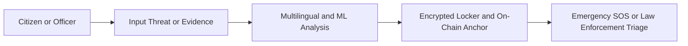
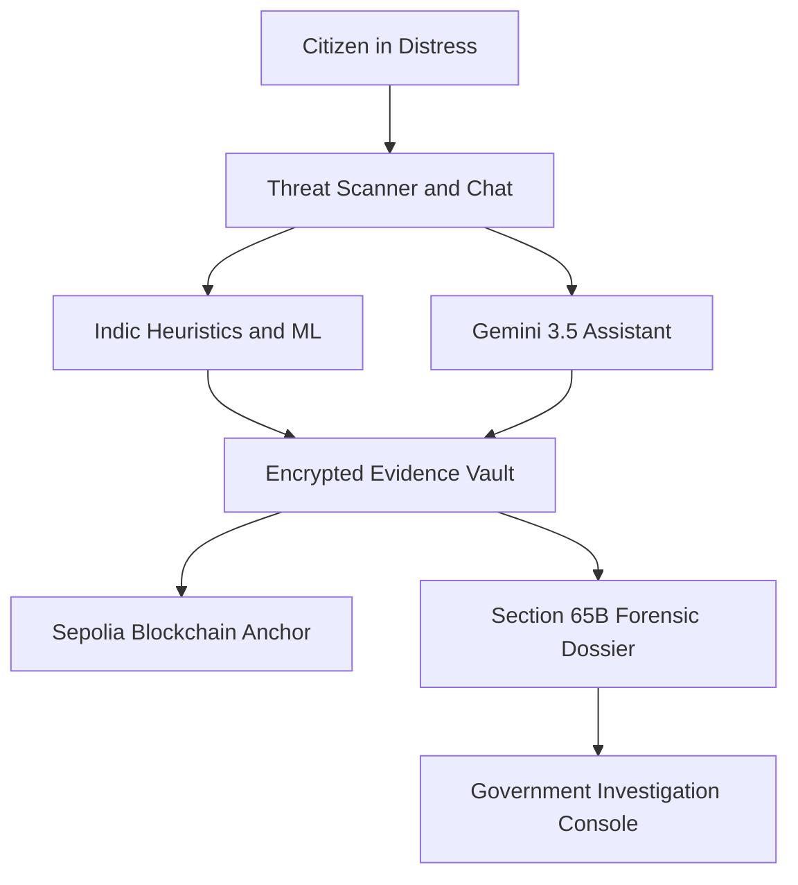
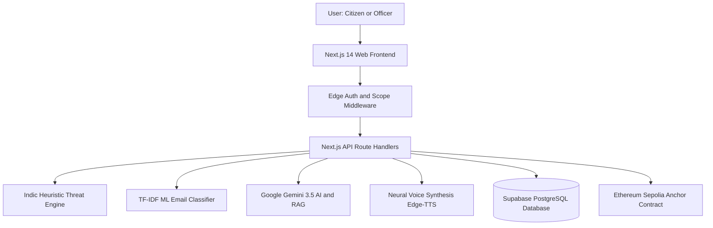
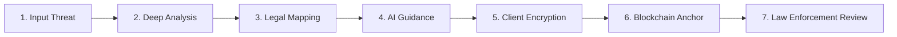
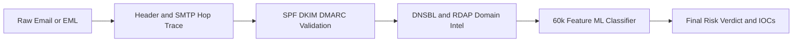
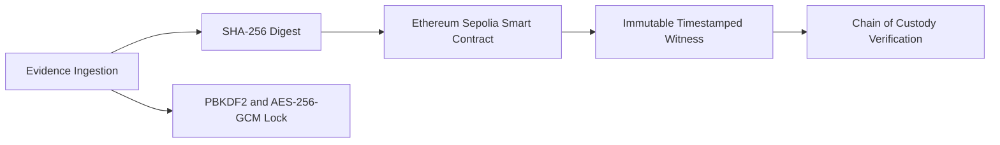
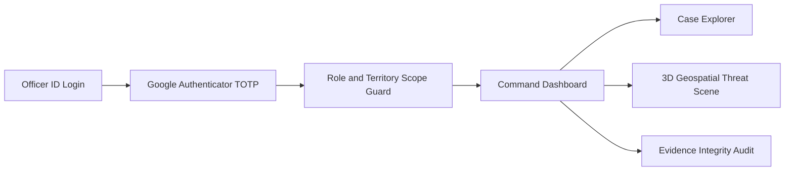
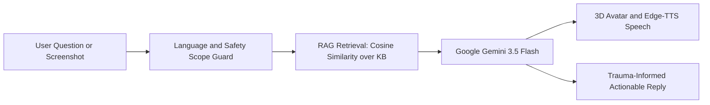
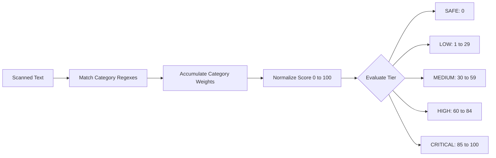

# 🛡️ Cyber Sakhi

> **AI-powered digital safety companion and forensic intelligence platform for proactive threat detection, trauma-informed survivor assistance, cryptographically sealed evidence custody, and law enforcement case triage.**

[](https://nextjs.org/)
[](https://www.typescriptlang.org/)
[](https://tailwindcss.com/)
[](https://supabase.com/)
[](https://sepolia.etherscan.io/)
[](https://ai.google.dev/)
[](https://vitest.dev/)

**Built for the Smart India Hackathon (SIH)** · *Empowering citizens against cyber harassment and enabling rapid forensic response.*



---

## 🚨 The Problem

• **Pervasive Cyber Harassment**: Millions of women and digital users face online stalking, blackmail, sextortion, and non-consensual image abuse daily.  
• **Colloquial Language Barrier**: Threats are frequently written in Romanised Hindi (*Hinglish*) or regional code, slipping past standard English-only filters.  
• **Fragile Digital Evidence**: Digital proof is routinely deleted or dismissed in legal proceedings due to broken chains of custody and non-compliance with statutory standards (**Section 65B Indian Evidence Act**).  
• **Investigation Backlog**: Police officers and cyber cells lack automated forensic parsing, territorial triage, and structured incident dossiers.

---

## 💡 The Solution

• **Multilingual Detection**: Real-time heuristic and machine learning threat analysis across English, Hinglish, and Hindi (Devanagari).  
• **Trauma-Informed Companion**: Bilingual AI guide (Gemini 3.5 Flash) with RAG grounding, verified helplines, and an interactive 3D WebGL avatar.  
• **Cryptographic Evidence Locker**: Client-side envelope encryption (**AES-256-GCM** + **PBKDF2**) with zero server-side plaintext access.  
• **Blockchain Witness**: Immutable timestamped anchoring of evidence SHA-256 digests onto the **Ethereum Sepolia testnet**.  
• **Government Console**: Role- and territory-scoped portal for investigators with TOTP MFA, 3D geospatial crime visualization, and automated dossier exports.



---

## ✨ Key Features

| 🛡️ Threat Detection | 📧 Email Forensics | 🔐 Evidence Locker |
|---|---|---|
| Scans messages for blackmail, stalking, and scams with Indian legal mapping (IT Act & BNS). | Deep RFC-822 parser, SMTP hop trace, SPF/DKIM verification, and 60k-feature ML model. | Client-side envelope encryption (**AES-256-GCM**) with tamper-evident chain of custody. |

| 🤖 Sakhi AI & 3D Avatar | 🏛️ Government Console | 🚨 Emergency SOS |
|---|---|---|
| Bilingual trauma-aware AI (Gemini 3.5) with WebGL talking avatar and neural Indian TTS. | Law enforcement portal with TOTP MFA, territorial RBAC/ABAC, and 3D India geospatial scene. | 1-tap emergency trigger, automatic location broadcast, and simulated WhatsApp/SMS dispatch. |

---

## 🏗️ System Architecture



• **Frontend**: Next.js 14 App Router, Tailwind CSS, Three.js 3D scene, and TalkingHead avatar runtime.  
• **API & Middleware**: Edge session routing, fail-closed access guards, and REST route handlers.  
• **Processing Engines**: TypeScript regex heuristic engine, pure-TS TF-IDF softmax classifier, and cosine RAG retriever.  
• **Persistence & Web3**: Supabase PostgreSQL with Row Level Security and Ethereum Sepolia smart contracts.

---

## 🔄 How Cyber Sakhi Works



1. **Input Threat**: User enters suspect text, uploads screenshot images, or pastes raw email headers.  
2. **Deep Analysis**: System triggers multilingual regex heuristics and ML classification.  
3. **Legal Mapping**: Translates detected risk into Indian statutory sections (**IT Act 2000 & BNS**).  
4. **AI Guidance**: Sakhi AI provides empathetic support, safe next steps, and official helpline directions.  
5. **Client Encryption**: Evidence is encrypted locally using **AES-256-GCM** with a **PBKDF2**-derived key.  
6. **Blockchain Anchor**: A canonical **SHA-256** digest is anchored to Ethereum Sepolia for tamper-proofing.  
7. **Law Enforcement Review**: Authorized officers review structured dossiers inside the Government Console.

---

## 📧 Email Threat Detection



• **SMTP Hop Traversal**: Extracts received timestamps, MTA anomalies, and originating public IP.  
• **Authentication Verification**: Validates cryptographic SPF, DKIM, DMARC, and ARC alignment.  
• **Threat Intelligence**: Checks extracted IPs against DNSBL blacklists (Spamhaus, SORBS) and scans RDAP domain age.  
• **ML Classification**: Multinomial Logistic Regression over 60,000 unigram/bigram TF-IDF features ([`lib/ml/inference.ts`](lib/ml/inference.ts)).  
• **BEC & Urgency Heuristics**: Detects financial impersonation, executive spoofing, and wire transfer coercion.

---

## 🔐 Evidence & Integrity



• **SHA-256 Integrity Hashing**: Creates an irreversible cryptographic fingerprint of the canonical evidence payload.  
• **Envelope Encryption**: Content is encrypted in-browser using random 256-bit AES-GCM keys; plaintext never reaches the server ([`lib/lockCrypto.ts`](lib/lockCrypto.ts)).  
• **Blockchain Anchoring**: Writes `keccak256(id)` + `sha256(digest)` to the `EvidenceAnchor.sol` contract on Ethereum Sepolia.  
• **Court Verification**: Detects post-incident tampering to produce court-admissible dossiers under Section 65B of the Indian Evidence Act.

---

## 🏛️ Government Console

A dedicated operational subsystem located at `/gov` for cyber crime investigators and district officers.



| Area | Purpose | Code Reference |
|---|---|---|
| 🔑 **Authentication** | Officer ID (`SS-DDD-NNNN`), bcrypt cost 12, sliding lockout, and Google Authenticator TOTP MFA. | [`lib/gov/govAuth.ts`](lib/gov/govAuth.ts) |
| 🛡️ **Access Control** | Fail-closed RBAC (`SUPER_ADMIN`, `INVESTIGATOR`, etc.) and territorial ABAC (`ALL_INDIA`, `STATE`, `DISTRICT`). | [`lib/gov/govPermissions.ts`](lib/gov/govPermissions.ts) |
| 📂 **Cases** | Case triage, priority escalation, investigator assignment, victim history, and officer case notes. | [`app/gov/cases`](app/gov/cases) |
| 🔐 **Evidence Vault** | Repository-wide SHA-256 hash integrity verifier and immutable chain-of-custody tracking. | [`app/gov/evidence`](app/gov/evidence) |
| 🗺️ **3D Geospatial Map** | Interactive Three.js WebGL extrusion of Indian states with incident density scaling. | [`components/gov/India3DScene.tsx`](components/gov/India3DScene.tsx) |
| 📄 **Reports** | Formal complaint-ready Section 65B forensic case dossier export. | [`app/gov/reports`](app/gov/reports) |
| 🧾 **Audit Trail** | Immutable security audit logging with secret scrubbing and CSV export for compliance. | [`app/gov/audit`](app/gov/audit) |

---

## 🤖 Sakhi Assistant



• **Empathetic AI Model**: Powered by Google Gemini (`gemini-3.5-flash`) via server-side REST API ([`lib/ai/gemini.ts`](lib/ai/gemini.ts)).  
• **Grounded RAG**: Retrieves verified safety facts from a curated knowledge base using TF-IDF cosine similarity ([`lib/rag/retrieve.ts`](lib/rag/retrieve.ts)).  
• **Multimodal Screenshot Forensics**: Safely inspects up to 3 attached images (max 15MB) for scam detection without server storage.  
• **3D Voice Avatar Mode**: Features Three.js WebGL rendering, phoneme viseme lip-sync, and neural Indian English/Hindi TTS (`node-edge-tts`).

---

## 📊 Risk Scoring



### Incident Risk Categories & Legal Mapping ([`lib/threatEngine.ts`](lib/threatEngine.ts))

| Category | Trigger Weights | Primary Statutory Mapping |
|---|---|---|
| **Extortion & Blackmail** | 35 – 45 | IT Act 2000 Sec 66E · BNS Sec 351 |
| **Cyberstalking & Physical Threats** | 40 – 50 | BNS Sec 78 (IPC 354D) · BNS Sec 351 |
| **Sexual Harassment** | 35 – 40 | IT Act 2000 Sec 67/67A · BNS Sec 75 |
| **Financial Fraud & Scams** | 25 – 30 | IT Act 2000 Sec 66D |
| **Doxxing & Privacy Breach** | 30 | IT Act 2000 Sec 66E |
| **Abusive / Hate Speech** | 25 | BNS Sec 351 |

---

## 🧩 Technology Stack

| Layer | Technology |
|---|---|
| **Frontend** | Next.js 14.2 (App Router), React 18, Tailwind CSS, Lucide React |
| **Backend** | Next.js Edge & Node.js Serverless Route Handlers |
| **Database** | Supabase (PostgreSQL 15) with Row Level Security (RLS) |
| **Security & Auth** | NextAuth.js, bcryptjs, Web Crypto API (PBKDF2 + AES-GCM), TOTP MFA |
| **AI & NLP** | Google Gemini 3.5 Flash, TF-IDF + Logistic Regression, Curated RAG |
| **Voice & 3D** | Three.js, @met4citizen/talkinghead, node-edge-tts (`en-IN`, `hi-IN`) |
| **Blockchain** | Solidity (`^0.8.24`), Hardhat, Ethers.js, Ethereum Sepolia Testnet |
| **Testing** | Vitest 2.1.9, TypeScript 5.5 |
| **Deployment** | Vercel Serverless & Edge Network |

---

## 📁 Project Structure

```
cyber-sakhi/
├── app/                  # App Router pages and REST API handlers
│   ├── api/              # Public & citizen API routes (threats, chat, evidence)
│   ├── gov/              # Government Console pages and scoped APIs (/gov)
│   ├── companion/        # Sakhi AI chat and 3D voice avatar interfaces
│   ├── dashboard/        # Citizen Five-Pillar safety dashboard
│   ├── detector/         # Multilingual message threat scanner
│   ├── email-forensics/  # Deep email forensic inspection UI
│   └── locker/           # Client-side encrypted evidence locker
├── blockchain/           # Solidity contracts (EvidenceAnchor.sol) & deploy scripts
├── components/           # Reusable UI components (GovDashboardShell, BrandLogo)
├── lib/                  # Core algorithms (threatEngine, lockCrypto, ai, gov)
├── models/               # Pre-trained ML artifacts (models/ml/email_classifier.json)
├── public/               # Static assets, official logos, 3D meshes, GeoJSON
├── supabase/migrations/  # Database schemas, RLS rules, and migration scripts
└── tests/                # Vitest unit and integration test suites
```

---

## 🔌 API Reference

| Area | Method | Endpoint | Purpose |
|---|---|---|---|
| **Threats** | `POST` | `/api/analyze-threat` | Scans text for threats, scores severity, and returns legal sections. |
| **AI Chat** | `POST` | `/api/chat` | Main conversational endpoint with Gemini 3.5 and RAG grounding. |
| **Voice** | `POST` | `/api/voice/tts` | Synthesizes neural audio (MP3 + visemes) using Edge-TTS. |
| **Evidence** | `POST` | `/api/evidence` | Ingests encrypted evidence with SHA-256 digests and custody logs. |
| **Evidence** | `POST` | `/api/evidence/[id]/anchor` | Anchors an evidence digest to the Ethereum Sepolia testnet. |
| **Forensics** | `POST` | `/api/email-forensics` | Parses RFC-822/EML files; extracts hops, auth, and ML verdicts. |
| **Gov Auth** | `POST` | `/gov/api/login` | Authenticates officers via Officer ID, password, and TOTP MFA. |
| **Gov Cases**| `GET`  | `/gov/api/cases` | Retrieves jurisdiction-scoped cases for investigation. |
| **Gov Geo**  | `GET`  | `/gov/api/geo/map` | Aggregates geographic incident density for the 3D scene. |
| **Gov Audit**| `GET`  | `/gov/api/audit` | Retrieves immutable compliance audit log entries. |

---

## ⚙️ Quick Start

### 1. Installation
```bash
git clone https://github.com/sambhav-coder/cyber-sakhi.git
cd cyber-sakhi
npm install
```

### 2. Environment Setup (`.env.local`)
```env
NEXTAUTH_SECRET=your-secret-32-chars-minimum
NEXTAUTH_URL=http://localhost:3000

NEXT_PUBLIC_SUPABASE_URL=https://your-project.supabase.co
NEXT_PUBLIC_SUPABASE_PUBLISHABLE_KEY=your-supabase-key
SUPABASE_SERVICE_ROLE_KEY=your-service-role-key

GEMINI_API_KEY=your-gemini-api-key
GEMINI_MODEL=gemini-3.5-flash

# Optional: Blockchain Anchoring (Sepolia Testnet)
BLOCKCHAIN_ANCHOR_ENABLED=false
BLOCKCHAIN_RPC_URL=https://ethereum-sepolia-rpc.publicnode.com
BLOCKCHAIN_CHAIN_ID=11155111
BLOCKCHAIN_PRIVATE_KEY=your-private-key
BLOCKCHAIN_ANCHOR_CONTRACT_ADDRESS=0xYourContractAddress
```

### 3. Run Development Server
```bash
npm run dev
```
Open **[http://localhost:3000](http://localhost:3000)** in your browser.

---

## 🧪 Testing

| Command | Purpose |
|---|---|
| `npm test` | Runs the full Vitest unit and integration test suite (80+ test files). |
| `npm run test:watch` | Runs tests in interactive watch mode for active development. |
| `npm run chain:compile` | Compiles the `EvidenceAnchor.sol` Solidity contract via Hardhat. |
| `npm run chain:deploy:local` | Simulates contract deployment on a local in-process Hardhat EVM. |

---

## 🚀 Deployment

1. **Push Code**: Commit your changes to GitHub.  
2. **Import into Vercel**: Connect the repository to your Vercel team dashboard.  
3. **Set Environment Variables**: Configure `NEXTAUTH_SECRET`, `SUPABASE_*`, and `GEMINI_API_KEY`.  
4. **Deploy**: Vercel automatically bundles edge middleware, serverless endpoints, and cron jobs.

---

## 🗺️ Roadmap

### ✅ Implemented
• Multilingual Indic threat engine (Hinglish, Hindi, English) with IT Act & BNS mapping.  
• Pure-TypeScript TF-IDF + Logistic Regression email threat classifier.  
• Full RFC-822 email forensics studio with SMTP hop tracing and domain intelligence.  
• Trauma-aware AI companion with Gemini 3.5 Flash and RAG grounding.  
• 3D WebGL avatar lip-sync with neural Edge-TTS synthesis.  
• Client-side envelope encryption (**AES-256-GCM** + **PBKDF2**).  
• Ethereum Sepolia blockchain evidence anchoring via `EvidenceAnchor.sol`.  
• Government Console with TOTP MFA, territory-scoped cases, and 3D geospatial mapping.

### 🚧 In Progress
• Direct API integration with the National Cyber Crime Reporting Portal (`cybercrime.gov.in`).  
• Offline local speech recognition engine.  
• District-level polygon vector boundaries for sub-state mapping.

### 🔮 Future
• Hardware Security Module (HSM) key management integration for government tier deployments.  
• Zero-Knowledge Proofs (zk-SNARKs) for anonymous campus threat sharing.

---

## 👥 Team

• **Cyber Sakhi Team** — Developed for the **Smart India Hackathon (SIH)**.  
• Dedicated to empowering citizens, defending digital rights, and accelerating cyber forensics.

---

## 📜 License

• **Application Source Code**: Open-source educational build for the Smart India Hackathon.  
• **Third-Party Attributions** ([`THIRD_PARTY_LICENSES.md`](THIRD_PARTY_LICENSES.md)): `@met4citizen/talkinghead` (MIT), `three` (MIT), 3D Avatar Mesh (CC BY-NC 4.0), ML Research Corpora (CC BY 4.0).
